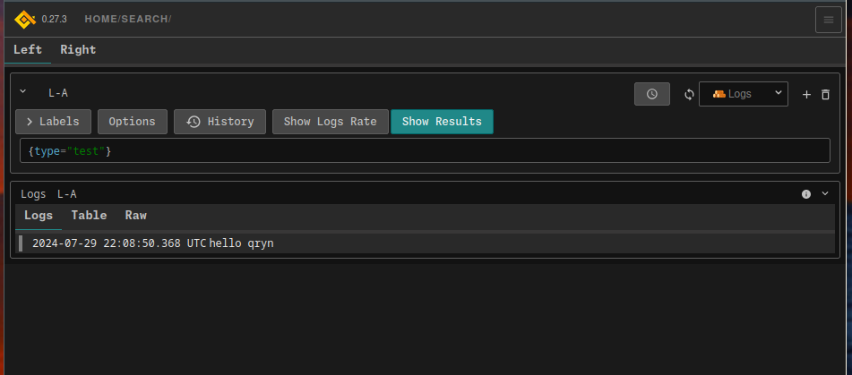

# Monitoring Setup
Set up and use the monitoring system with Loki, qryn, and Grafana.

## Run:
```bash
docker-compose up -d
```

## Sending Logs Using Loki API

To send logs to Loki using its API, you can use the following `curl` command:

```bash
curl -i -XPOST -H "Content-Type: application/json" http://localhost:3100/loki/api/v1/push      --data '{"streams":[{"stream":{"type":"test"},"values":[['$(date +"%s%N")', "hello qryn"]]}]}'
```

### Command Breakdown
- `curl`: Command-line tool for transferring data with URLs.
- `-i`: Includes the HTTP response headers in the output.
- `-XPOST`: Specifies that the request method is POST.
- `-H "Content-Type: application/json"`: Sets the content type of the request to JSON.
- `http://localhost:3100/loki/api/v1/push`: The Loki API endpoint to push logs.
- `--data`: Specifies the data to be sent in the request.

The JSON payload:
```json
{
  "streams": [
    {
      "stream": {
        "type": "test"
      },
      "values": [
        [$(date +"%s%N"), "hello qryn"]
      ]
    }
  ]
}
```
- `"streams"`: A list of streams, where each stream contains:
  - `"stream"`: A set of labels for the log stream.
  - `"values"`: A list of log entries, where each entry is a tuple containing the timestamp and log message.

## Viewing Logs

### qryn
To view the logs in qryn, open your browser and go to:
- [qryn Dashboard](http://localhost:3100/)

### Grafana
To view the logs in Grafana, open your browser and go to:
- [Grafana Dashboard](http://localhost:3000/)

#### Grafana Login Credentials
- **Username**: `admin`
- **Password**: `admin`

### Example qryn Dashboard

Below is an example of what the qryn dashboard looks like:


